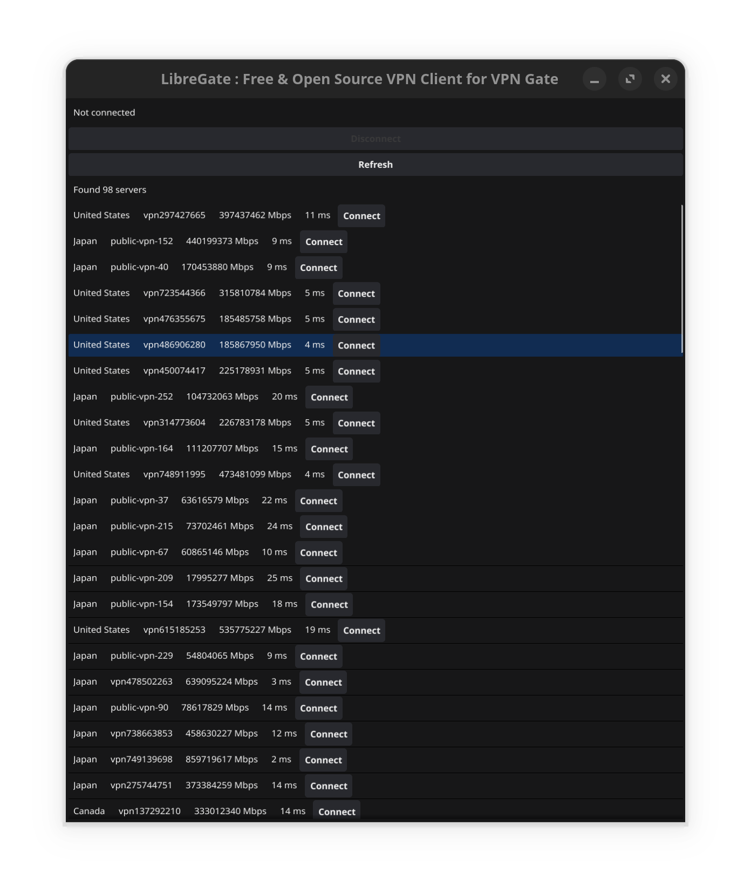

# LibreGate: Free & Open Source VPN Client for VPN Gate


[](https://www.gnu.org/licenses/gpl-3.0)
[](https://goreportcard.com/report/github.com/zrebar/LibreGate)


## Overview

LibreGate is a free, open-source VPN client for Linux, designed to work with VPN Gate. It offers a simple interface to connect to VPN servers, enhancing online privacy and security. VPN Gate, developed by the University of Tsukuba, Japan, provides access to thousands of public VPN servers globally. LibreGate streamlines the connection process with its user-friendly design.


## Features

- **Easy-to-use Interface**: Simple and intuitive GUI built with Fyne.
- **Server Management**: Fetch and load VPN servers with ease.
- **Secure Connections**: Connect to VPN servers using OpenVPN.
- **Cross-Platform**: Works on Linux & macOS (Windows, iOS & Android support planned).

## Screenshots



[//]: # (![Screenshot 2]&#40;path/to/screenshot2.png&#41;)

## Usage

1. Install OpenVPN:
    ```sh
    sudo apt install openvpn
    ```
2. Download the binary & launch LibreGate:
    ```sh
    ./libregate
    ```
2. Click on the "Fetch Servers" button to retrieve the latest VPN servers.
3. Select a server from the list and click "Connect". This will establish a VPN connection in a new terminal window.
4. Enjoy having easy access to thousands of free VPNs across many countries worldwide and a secure and private browsing experience.

## Installation

### Prerequisites

- Go 1.16 or higher
- OpenVPN
- Fyne

### Steps

1. Clone the repository:
    ```sh
    git clone https://github.com/zrebar/LibreGate.git
    cd libregate
    ```

2. Install dependencies:
    ```sh
    go mod tidy
    ```

3. Build the project:
    ```sh
    go build -o libregate ./cmd/libregate/main.go
    ```

4. Run the application:
    ```sh
    ./libregate
    ```


## Configuration

LibreGate uses a configuration file located at `~/.config/libregate/config.json`. You can customize the VPN command if needed, modify this only if you want to use a different VPN client (that supports VPNGate).

```json
{
    "vpn_command": "openvpn"
}
```
## Disclaimer

This project is not affiliated with VPN Gate or the University of Tsukuba. It is an independent project developed by the community to provide an easy-to-use VPN client for VPN Gate on Linux & macOS. Use it at your own risk.